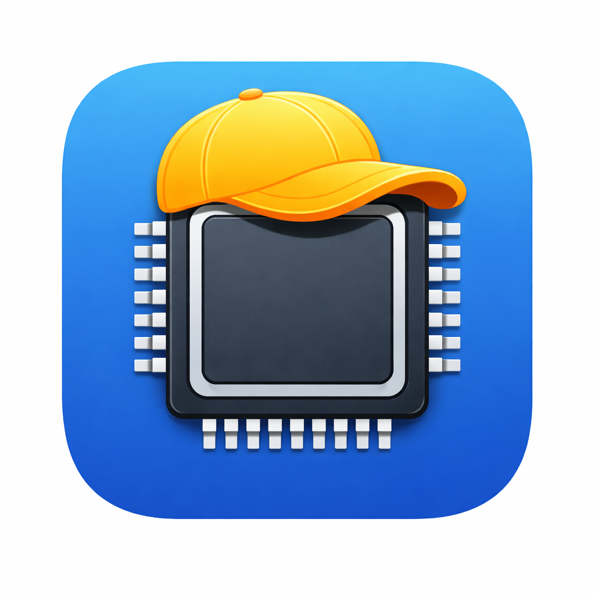
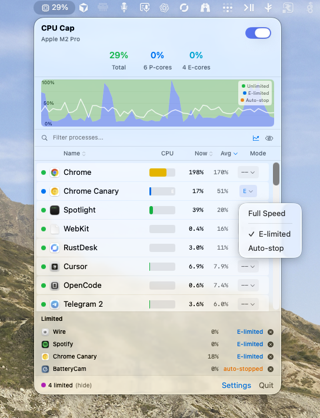
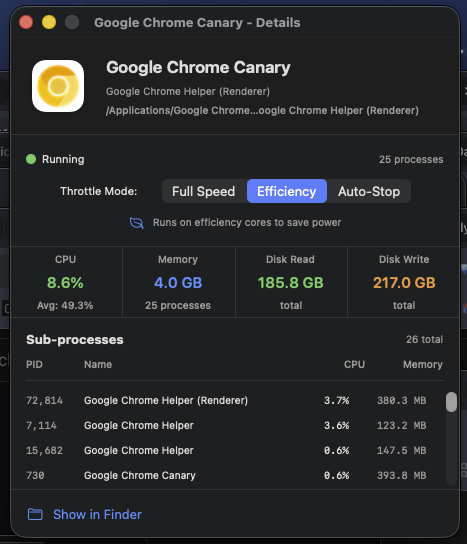
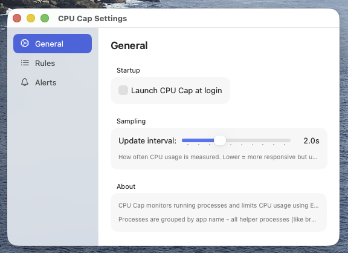

<p align="center">
  
</p>

<h1 align="center">CPU Cap</h1>

<p align="center">
  <strong>Free macOS menu bar app that limits CPU-hungry apps to efficiency cores.</strong><br>
  An open-source alternative to App Tamer ($15).
</p>

<p align="center">
  <a href="https://github.com/nostitos/macos-cpucap/releases/latest"><strong>Download Latest Release</strong></a>
</p>

---



## What It Does

Some apps hog your CPU even when you're not using them - draining battery, spinning fans, and slowing everything down. CPU Cap pushes background apps to efficiency cores, saving up to 70% energy.

**Before:** Chrome uses 80% CPU in the background on P-cores, laptop gets hot  
**After:** Chrome is E-limited, uses 70% less power, stays cool and quiet

## Features

- **E-limited mode** - Limit apps to E-cores to save power
- **Auto-stop mode** - Pause apps in background, resume when focused
- **Real P-core / E-core monitoring** - Actual per-core-type CPU stats via `host_processor_info()`
- **Live stacked CPU chart** - See unlimited, E-limited, and auto-stopped CPU at a glance
- **CPU hog alerts** - Get notified when an app uses too much CPU
- **Near-zero idle CPU** - Only samples processes when the menu is open
- **Adjustable sampling** - Set update interval from 0.5s to 5s
- **Right-click menu** - Quick access to Settings and Quit
- **Open source** - Free forever, no tracking, no ads

## How It Works

CPU Cap uses macOS Quality of Service (QoS) to control which CPU cores apps run on:

| Mode | What it does | Best for |
|------|--------------|----------|
| **Full Speed** | Runs on all cores (P + E) | Active apps |
| **E-limited** | Limits to E-cores via background QoS | Background apps you want running |
| **Auto-stop** | Freezes app in background, resumes when focused | Apps you only need when visible |

**Automatic restore:** When you switch to a limited app (bring it to the foreground), CPU Cap automatically restores full P-core access. When you switch away, the limit is re-applied. You never have to manually toggle modes.

**Graceful Auto-stop:** Auto-stop uses a two-phase approach to avoid crashes. When backgrounding: the app is E-limited first, then frozen after 2 seconds. When foregrounding: the app is unfrozen but kept E-limited for 3 seconds while it reconnects, then restored to full speed. Some apps may still not handle being frozen — use E-limited mode if an app misbehaves.

### Why E-cores?

Apple Silicon Macs have two types of CPU cores:
- **P-cores (Performance)** - Fast but power-hungry
- **E-cores (Efficiency)** - Slower but use ~70% less energy

When you E-limit an app, it keeps running smoothly but uses far less power. Your P-cores stay free for the apps you're actively using.

## The Interface

### Header

Shows your CPU model (e.g., "Apple M2 Pro") and real-time usage:
- **Total** - Overall CPU usage (P + E combined)
- **X P-cores** - Performance core usage
- **X E-cores** - Efficiency core usage

These numbers are measured per-core and always add up: P-cores + E-cores = Total.

### Stacked CPU Chart


Stacked area chart showing CPU breakdown over time:
- **Green** - Unlimited apps
- **Blue** - E-limited apps
- **Orange** - Auto-stopped apps
- **White line** - Total CPU

### Process List

Apps sorted by CPU usage. Each row shows:
- **Status dot** - Green (unlimited), Blue (E-limited), Orange (auto-stopped)
- **App name** - Click for detailed sub-process view
- **CPU bar** - Visual bar (full = 50% of P-core capacity)
- **Now** - Current CPU %
- **Avg** - Lifetime average CPU
- **Mode** - Click dropdown to change (E = E-limited, S = Auto-stop)

### Process Details

Click any app name to see detailed info:



- App info, bundle path, version
- Per-sub-process CPU and memory breakdown
- Throttle mode selector
- "Show in Finder" link

### Footer

Shows count of limited apps with a **(show)**/**(hide)** toggle to expand the list. Each limited app shows its mode (E-limited or auto-stopped) and has a remove button.

## Settings

Right-click the menu bar icon or click "Settings" in the footer:



- **Startup** - Launch CPU Cap at login
- **Sampling** - Adjust update interval (0.5s - 5s). Lower = more responsive, higher = less CPU
- **Rules** - View, toggle, and delete saved app modes
- **Alerts** - Configure CPU hog notifications (threshold, duration, enable/disable)

## Installation

1. Download the DMG from [Releases](https://github.com/nostitos/macos-cpucap/releases)
2. Open the DMG file
3. Drag CPU Cap to your Applications folder
4. Open CPU Cap from Applications

The app is signed and notarized by Apple, so it opens without any Gatekeeper warnings.

Requires macOS 14.0 (Sonoma) or later. Optimized for Apple Silicon (M1/M2/M3/M4).

## Performance

CPU Cap is designed to use minimal resources:

- **Menu closed:** Near-zero CPU. Only a lightweight `host_processor_info()` call every 5 seconds to update the menu bar icon.
- **Menu open:** Full process sampling at your configured interval (default 2s).
- **No redundant work:** Rules are applied on change, not polled. Timers stop when not needed.

## FAQ

**Does it work on Apple Silicon (M1/M2/M3/M4)?**  
Yes! CPU Cap is built for Apple Silicon and uses real per-core-type CPU monitoring.

**What's the difference vs App Tamer or percentage-based throttling?**  
Old tools freeze apps in cycles (run 20%, frozen 80%), causing stuttering. E-limiting keeps apps running smoothly on slower cores - no freezing, no stuttering.

**Will E-limiting slow down my apps?**  
Only in the background. E-cores are 2-3x slower than P-cores, but for background tasks this is usually fine. When you switch to the app, CPU Cap automatically restores full P-core access — you won't notice any slowdown while actively using it.

**What about Auto-stop mode?**  
Auto-stop freezes the app when it's in the background and resumes it when you switch back. It uses a graceful two-phase transition (E-limit before freezing, E-limit after resuming) to reduce crashes. However, some apps — especially Electron apps, apps with WebSockets, or apps with background sync — may still not handle it well. If an app crashes, switch it to E-limited instead.

**Why does Activity Monitor still show high CPU?**  
Activity Monitor shows total CPU time, not which cores are being used. An E-limited app may show high %, but it's using less power because it's on E-cores.

**Does it remember my settings?**  
Yes. All modes are saved to UserDefaults and restored automatically.

**How do the P-core / E-core percentages work?**  
CPU Cap reads actual per-core CPU ticks via `host_processor_info()` and sums them by core type. The values represent each type's share of total CPU capacity, so P-cores + E-cores = Total.

## Building from Source

Requires Xcode 15+ and macOS 14+.

```bash
git clone https://github.com/nostitos/macos-cpucap.git
cd macos-cpucap

# Development build
cd CPUCap
swift build
.build/debug/CPUCap

# Release build (universal binary: arm64 + x86_64)
./scripts/build-release.sh 1.2.1

# Create DMG installer
./scripts/create-dmg.sh 1.2.1
```

## Project Structure

```
macos-cpucap/
├── CPUCap/                     # Swift package
│   ├── Package.swift
│   └── CPUCap/
│       ├── CPUCapApp.swift         # App entry, MenuBarExtra
│       ├── AppDelegate.swift       # Right-click menu, notifications
│       ├── Core/
│       │   ├── ProcessMonitor.swift    # Process sampling, per-core CPU
│       │   ├── CPULimiter.swift        # setpriority / SIGSTOP throttling
│       │   ├── ProcessInfo.swift       # Data models
│       │   └── HogDetector.swift       # CPU hog alerts
│       ├── Rules/
│       │   ├── Rule.swift              # ThrottleMode enum
│       │   ├── RuleStore.swift         # Persistence, rule management
│       │   └── DefaultRules.swift      # Suggested modes
│       └── UI/
│           ├── MenuBarView.swift       # Main menu window
│           ├── ProcessRowView.swift    # Per-app row
│           ├── ProcessDetailView.swift # Detail window
│           ├── SettingsView.swift      # Settings window
│           └── Components/
│               ├── CPUBar.swift        # Per-app CPU bar
│               ├── CPUGraph.swift      # Stacked area chart
│               ├── CPUSummaryHeader.swift
│               └── CapPicker.swift     # Mode dropdown
├── scripts/                    # Build & packaging scripts
├── dmg-resources/              # DMG background
└── screenshots/                # README images
```

## Contributing

Contributions welcome! Please open an issue first to discuss changes.

## License

MIT License - see [LICENSE](LICENSE)

---

**Like CPU Cap?** Star the repo to help others find it!
